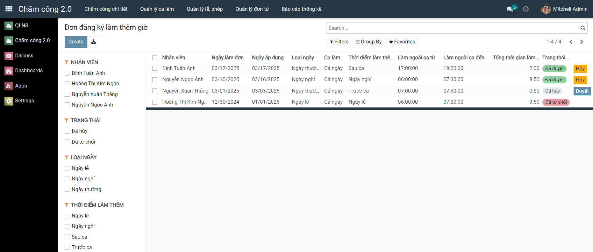

Hệ thống chấm công Odoo:
Hệ thống chấm công đã được xây dựng với đầy đủ các chức năng quản lý chấm công, giúp doanh nghiệp tự động hóa quy trình theo dõi thời gian làm việc của nhân viên. Cụ thể, hệ thống hỗ trợ:
- Quản lý nhân viên với thông tin cá nhân đầy đủ và lịch sử công tác.
- Quản lý ca làm việc, cho phép đăng ký ca làm và tạo đợt đăng ký theo tháng.
- Ghi nhận và tính toán chấm công chính xác, tự động xác định trạng thái đi muộn, về sớm, nghỉ và tổng số giờ làm, tổng số giờ công, giờ làm thêm.
- Xử lý đơn từ như nghỉ phép, đi muộn/về sớm, làm thêm giờ và phê duyệt đơn từ có liên quan.
- Quản lý ngày nghỉ lễ & phép năm.
- Tổng hợp dữ liệu chấm công phục vụ cho tính lương và xuất báo cáo chi tiết.
- Báo cáo và thống kê, cung cấp cái nhìn tổng quan về tình trạng chấm công của nhân viên và phòng ban theo các mốc thời gian.

1. Quản lý nhân viên 
Danh sách nhân viên:

Chi tiết nhân viên:

2. Quản lý ca làm

3. Quản lý ngày lễ

4. Quản lý ngày phép năm

5. Đăng ký ca làm
Đợt đăng ký ca làm:

Đăng ký ca làm theo ngày:

6. Quản lý đơn từ
Đơn xin nghỉ:

Đơn xin đi muộn về sớm:

Đơn đăng ký làm thêm giờ:

7. Chấm công
Chấm công chi tiết:

8. Báo cáo thống kê
